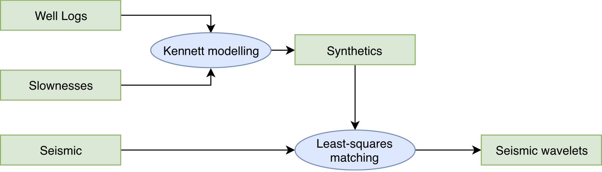

## Purpose

Seismic AVO inversion is usually deployed in a target-oriented setup, implying that the process does not start at the surface, or more precisely the source and receiver level, directly. The idea behind tying seismic data to well data is to calibrate out the propagation of seismic waves through the overburden. The process addresses transmission effects while non-linear effects, like multiple scattering or mode conversion in the overburde are supposed to be addressed, and ideally removed, by a standard seismic data processing workflow.

## Input

- Well logs
- Slowness vector
-

## Workflow

